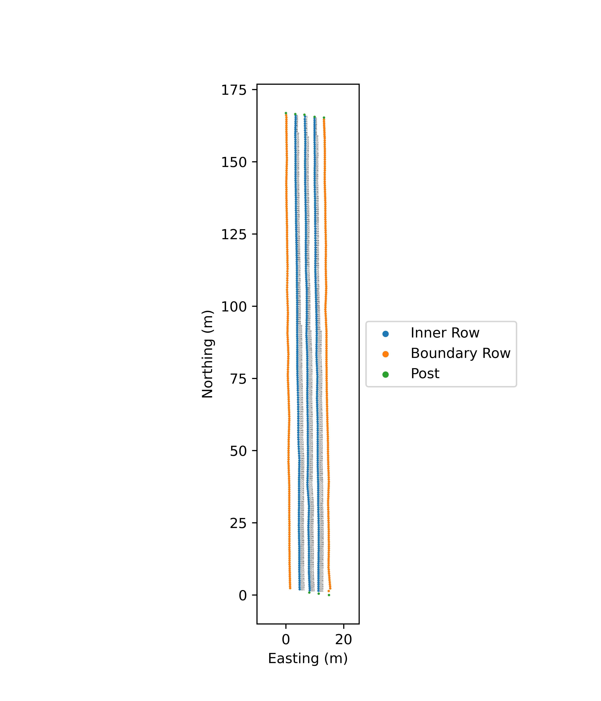

## Overview
Some notebooks/scripts for making the map of the test region of the blueberry farm. 


### View the Map in Google Earth

To view the map in Google Earth:

1. [Download the KML file](https://github.com/Jostan86/blueberry_farm_map/blob/main/data_map_2/blueberry_farm_map.kml).
2. Open [Google Earth](https://earth.google.com/web/).
3. Click on the menu icon and select "File" > "Import KML / KMZ file".
4. Select the downloaded KML file to view the map.

Alternatively, you can open Google Earth and drag the downloaded KML file directly into the browser window.


## Installation
Download the package:
```bash
cd /where/you/want/to/download
git clone https://github.com/Jostan86/blueberry_farm_map.git
```

Setup a venv:
```bash
cd /where/you/want/to/install/venv
python3 -m venv blueberry_map_venv
```

Activate the venv with:
```bash
source /venv/location/bin/activate
```

Then the requirements can be installed with:
```bash
cd /path/to/blueberry_farm_map
pip install -r requirements.txt
``` 
or:
```bash
pip install lxml matplotlib numpy pykml pyshp utm
```

## Usage
The data from SW Maps was saved as a .kmz file, so ```scripts/extract_kml_from_kmz.sh``` has been provided to extract the .kml from that. This can used as:
```bash
cd /path/to/blueberry_farm_map
chmod +x scripts/extract_kml_from_kmz.sh
./scripts/extract_kml_from_kmz.sh data_map_1/collected_data.kmz data_map_1/collected_data.kml
```
```scripts/project_config.py``` provides some configuration settings that will need to be set, primarily it's just paths for the project. Most importantly, the ```self.project_dir``` and ```self.data_dir``` variables will need to be set to the correct values. 

Then the notebooks ```make_map_1.ipynb``` and ```make_map_2.ipynb``` provide details on how the maps were created using the data in the .kml file. 

